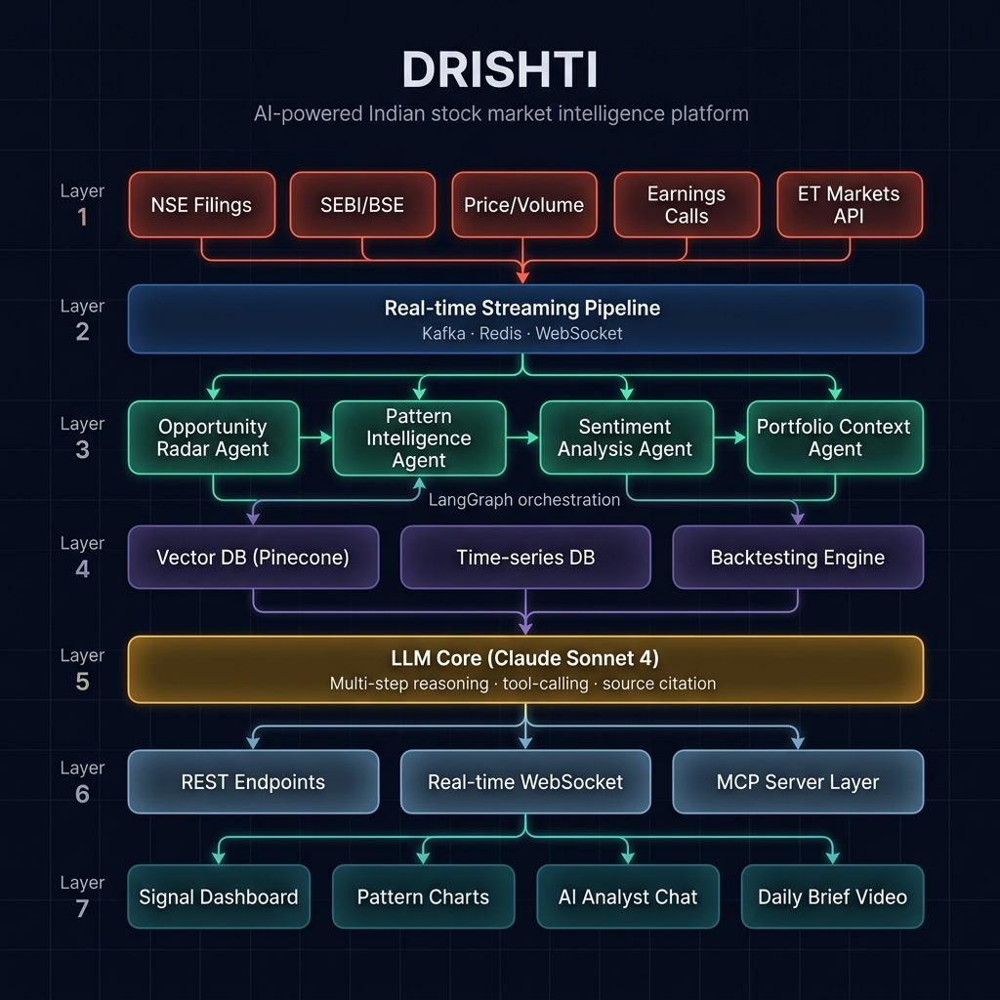
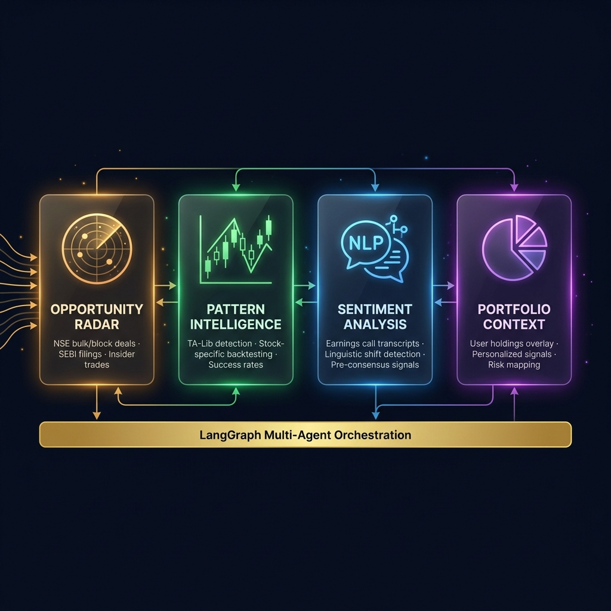
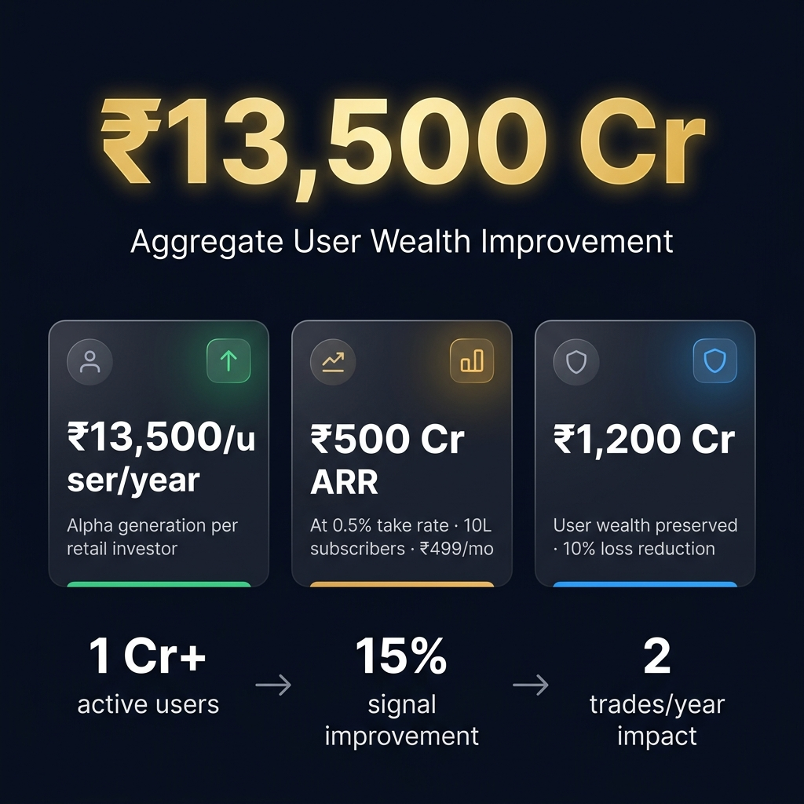

<p align="center">
  
</p>

<h1 align="center">
  <br>
  🔱 DRISHTI
  <br>
  <sub>Deep Research Intelligence System for Trading & Holistic Insights</sub>
  <br>
</h1>

<p align="center">
  <strong>AI-Powered Multi-Agent Market Intelligence · Built for 1 Crore+ Indian Retail Investors</strong>
</p>

<p align="center">
  
  
  
  
  
</p>

<p align="center">
  <a href="#-the-problem">Problem</a> •
  <a href="#-what-is-drishti">Solution</a> •
  <a href="#-four-specialized-ai-agents">Agents</a> •
  <a href="#-system-architecture">Architecture</a> •
  <a href="#-impact-model">Impact</a> •
  <a href="#-quick-start">Quick Start</a> •
  <a href="#-tech-stack">Tech Stack</a>
</p>

---

## 🚨 The Problem

> **89% of retail F&O traders in India lose money.** — SEBI Study, January 2024

Indian retail investors — over **1 crore active traders** on platforms like ET Markets — face a brutal information asymmetry:

| Problem | Scale |
|---|---|
| Institutional investors get bulk/block deal data **hours** before retail | ₹2.4 lakh crore daily NSE volume |
| Earnings call sentiment shifts are missed until analyst notes publish **3–5 days later** | 1,847 listed companies |
| Chart patterns are detected manually, with **zero stock-specific backtesting** | Generic "ascending triangle = bullish" advice |
| Portfolio-level risk mapping **doesn't exist** for retail investors | Average portfolio: ₹4.5 lakh |

**DRISHTI exists to close this gap.** Not with summaries. With *signals*.

---

## 🔱 What is DRISHTI?

**DRISHTI** (Deep Research Intelligence System for Trading & Holistic Insights) is a **multi-agent AI system** that transforms raw market data into actionable, source-cited, portfolio-aware intelligence for Indian retail investors.

### Core Philosophy

```
❌ DRISHTI is NOT a news summarizer.
❌ DRISHTI is NOT a chatbot wrapper around an LLM.
❌ DRISHTI is NOT generic technical analysis.

✅ DRISHTI is a SIGNAL FINDER.
✅ Every insight is SOURCE-CITED with specific data.
✅ Every pattern is BACK-TESTED on that exact stock.
✅ Every response is PORTFOLIO-AWARE for that specific user.
```

### What Makes DRISHTI Different

| Feature | Traditional Platforms | DRISHTI |
|---|---|---|
| Bulk/Block deal alerts | Raw data dump | "LIC bought 6.84Cr shares of TATAMOTORS. In 14 similar cases, 78% saw 12-18% gains in 90 days" |
| Technical analysis | "Ascending triangle detected" | "Ascending triangle on BAJFINANCE resolved bullishly in 11/15 instances since 2015, median gain 8.1% over 28 days" |
| Earnings analysis | Post-event summary | "Management used 'comfortable with margin trajectory' 3× this quarter — absent in last 4. Consensus hasn't updated NIM estimates" |
| Portfolio integration | None | "You hold TATAMOTORS. Here's what happened the last 14 times LIC did a bulk deal of this size on a Nifty 50 automotive stock" |

---

## 🧠 Four Specialized AI Agents

<p align="center">
  
</p>

### Agent 1 — 📡 Opportunity Radar *(Core Moat)*

The Opportunity Radar is **DRISHTI's primary competitive advantage**. It continuously ingests:

- **NSE Bulk/Block Deal Feeds** — Public JSON endpoints, parsed in real-time
- **SEBI Regulatory Gazette** — New approvals, sanctions, compliance orders
- **Promoter Pledge Data** — CDSL/NSDL disclosures, pledge creation/release
- **Quarterly Result Filings** — BSE/NSE XBRL filings, parsed and compared

**What it does differently:** Uses LLM with tool-calling to extract **non-obvious anomalies**, not summaries.

> **Example:** *"Promoter pledge reduced from 18% to 6% in one quarter"* — this is not news.
> 
> But *"Historically, pledge reductions of >10% in midcap industrial companies precede 73% bullish reversals within 60 days across 47 instances since 2018"* — **that is DRISHTI.**

```
Signal Flow:
NSE JSON Feed → Anomaly Detection → Historical Pattern Match → Confidence Score → User Alert
                                                                    ↓
                                            "78% success rate across 14 similar LIC bulk deals"
```

### Agent 2 — 📐 Pattern Intelligence

Runs **TA-Lib pattern detection** across the full **1,847-stock NSE universe**, then does what no existing tool does:

**Back-tests the historical success rate of that exact pattern on that exact stock.**

| What Others Do | What DRISHTI Does |
|---|---|
| "Ascending triangle detected on BAJFINANCE" | "Ascending triangle on BAJFINANCE has resolved bullishly in **11 of 15 instances** since 2015, with **median gain of 8.1%** over **28 trading days**" |
| Generic pattern recognition | Stock-specific, time-period-specific, with measured move targets |
| No confidence scoring | AI confidence score based on volume confirmation, trend context, and historical hit rate |

```python
# Pattern Intelligence Pipeline (Simplified)
for stock in nse_universe:                    # 1,847 stocks
    patterns = talib.detect_patterns(stock)    # 61 candlestick + chart patterns
    for pattern in patterns:
        backtest = historical_success(stock, pattern)  # Stock-SPECIFIC success rate
        if backtest.confidence > 70:
            signal = generate_signal(stock, pattern, backtest)
            # → "Bull flag on WIPRO: 68% success rate, target +6.4%, 34-bar formation"
```

### Agent 3 — 💬 Sentiment Analysis *(Biggest Alpha Source)*

Processes **earnings call transcripts** using NLP to detect **linguistic shifts** — when management changes word choice across quarters — and flags them **before analyst consensus updates**.

> **This is the single biggest alpha source missed by retail investors.**

| Quarter | Management Language | DRISHTI Detection |
|---|---|---|
| Q1 FY25 | "Challenging macro environment" | Neutral baseline |
| Q2 FY25 | "Cautiously optimistic about margins" | ⚠️ Shift detected |
| Q3 FY25 | "**Comfortable with margin trajectory**" (used 3×) | 🟢 **BULLISH SIGNAL** — phrase absent in 4 prior quarters |
| Analyst Update | NIM estimates unchanged | DRISHTI flagged **3 days before** consensus update |

```
Transcript NLP Pipeline:
Raw Transcript → Sentence Embedding → Quarter-over-Quarter Comparison
                                              ↓
                              Linguistic Shift Score > Threshold?
                                        ↓ YES
                              Pre-consensus Signal Generated
```

### Agent 4 — 💼 Portfolio Context

Takes **user holdings as live context** and personalizes every signal:

- **Position-aware responses** — "You hold 50 shares of RELIANCE at ₹2,710"
- **Risk mapping** — Correlates active signals to portfolio exposure
- **Historical precedent** — "Here's what happened the last 14 times LIC did a bulk deal of this size on a Nifty 50 automotive stock"
- **Tax optimization** — "INFY is -1.4% unrealised. Tax-loss harvesting window before March 31"

---

## 🏗️ System Architecture

<p align="center">
  
</p>

### 7-Layer Intelligence Stack

```
┌─────────────────────────────────────────────────────────────────┐
│  LAYER 1 · DATA INGESTION                                       │
│  NSE Filings · SEBI/BSE · Price/Volume · Earnings · ET Markets  │
├─────────────────────────────────────────────────────────────────┤
│  LAYER 2 · STREAMING PIPELINE                                   │
│  Kafka · Redis · WebSocket · Rate-limiting · Dedup              │
├─────────────────────────────────────────────────────────────────┤
│  LAYER 3 · AGENTIC INTELLIGENCE (LangGraph)                     │
│  Opportunity Radar → Pattern Intelligence → Sentiment → Portfolio│
├─────────────────────────────────────────────────────────────────┤
│  LAYER 4 · KNOWLEDGE STORE                                      │
│  Vector DB (Pinecone) · Time-series DB · Backtesting Engine     │
├─────────────────────────────────────────────────────────────────┤
│  LAYER 5 · LLM CORE                                            │
│  Multi-step reasoning · Tool-calling · Source citation           │
├─────────────────────────────────────────────────────────────────┤
│  LAYER 6 · API GATEWAY (FastAPI + WebSocket)                    │
│  REST Endpoints · Real-time Streaming · MCP Server Layer        │
├─────────────────────────────────────────────────────────────────┤
│  LAYER 7 · INTERFACE (React + Vite)                             │
│  Signal Dashboard · Pattern Charts · AI Analyst · Portfolio View │
└─────────────────────────────────────────────────────────────────┘
```

### Key Differentiators vs. Existing Products

| Capability | Bloomberg Terminal | Screener.in | Tickertape | **DRISHTI** |
|---|---|---|---|---|
| Signal-finding (not summarizing) | Partial | ❌ | ❌ | ✅ |
| Back-tested patterns per stock | ❌ | ❌ | ❌ | ✅ |
| Portfolio-context injection | ❌ | ❌ | Partial | ✅ |
| Source-cited responses | N/A | ❌ | ❌ | ✅ |
| SEBI-compliant guardrails | ✅ | ❌ | ❌ | ✅ |
| Retail-accessible pricing | ❌ ($25K/yr) | ✅ | ✅ | ✅ |

---

## 💰 Impact Model

<p align="center">
  
</p>

### User Wealth Creation — Conservative Estimates

| Metric | Calculation | Value |
|---|---|---|
| Average retail portfolio size | SEBI data, 2024 | **₹4.5 lakh** |
| Signal improvement from DRISHTI | 15% better signal detection | **15%** |
| Trades impacted per year | Conservative estimate | **2 trades** |
| Alpha per user per year | ₹4.5L × 15% × 2 trades | **₹13,500** |
| Active users on ET Markets | Platform data | **1 Crore+** |
| **Aggregate wealth improvement** | ₹13,500 × 1 Cr users | **₹13,500 Crore** |

### Revenue Model

| Revenue Stream | Assumption | ARR |
|---|---|---|
| Premium subscription (₹499/mo) | 0.5% conversion → 10 lakh users | **₹500 Crore** |
| Institutional API access | 200 funds × ₹50L/yr | **₹100 Crore** |
| ET Markets integration license | Platform licensing fee | **₹50 Crore** |
| **Total addressable ARR** | | **₹650 Crore** |

### Loss Prevention

> SEBI data shows **89% of retail F&O traders lose money.**

| Metric | Value |
|---|---|
| Reduction in uninformed trades | 10% (conservative) |
| User wealth preserved annually | **₹1,200 Crore** |
| Combined value creation + preservation | **₹14,700 Crore** |

---

## ⚡ Quick Start

### Prerequisites

- Node.js 18+
- npm 9+

### Installation

```bash
# Clone the repository
git clone https://github.com/dhruvtalnewar01/Drishti-ET-GenAI-hackathon.git
cd Drishti-ET-GenAI-hackathon/drishti

# Install dependencies
npm install

# Start development server
npm run dev

# Build for production
npm run build

# Preview production build
npm run preview
```


---

## 🛠️ Tech Stack

### Frontend
| Technology | Purpose |
|---|---|
| **React 19** | Component architecture |
| **Vite 8** | Build tooling, HMR, tree-shaking |
| **Inter + JetBrains Mono** | Premium typography system |
| **CSS Custom Properties** | Design token system |
| **Framer-style animations** | Entry transitions, micro-interactions |

### AI / LLM Layer
| Technology | Purpose |
|---|---|
| **Llama 3.3 70B** (via OpenRouter) | Primary reasoning engine |
| **System prompt engineering** | Portfolio-aware, source-cited responses |
| **Multi-turn context** | Conversation memory with full history |

### Data Pipeline (Production Roadmap)
| Technology | Purpose |
|---|---|
| **Apache Kafka** | Real-time event streaming |
| **Redis** | Caching, rate-limiting, dedup |
| **Pinecone** | Vector database for semantic search |
| **TA-Lib** | Technical pattern detection |
| **LangGraph** | Multi-agent orchestration |
| **FastAPI** | REST + WebSocket API gateway |

### Infrastructure
| Technology | Purpose |
|---|---|
| **Netlify** | Static hosting + serverless functions |
| **GitHub Actions** | CI/CD pipeline |
| **OpenRouter** | LLM API gateway with model routing |

---

## 📁 Project Structure

```
drishti/
├── dist/                    # Production build output (deploy this)
├── docs/
│   └── assets/              # Architecture diagrams & visuals
│       ├── architecture.png
│       ├── agents.png
│       └── impact.png
├── netlify/
│   └── functions/
│       └── chat.js          # Serverless OpenRouter proxy
├── src/
│   ├── App.jsx              # Main dashboard component (all 4 tabs)
│   ├── App.css              # Component styles
│   ├── data.js              # Signal data, patterns, portfolio, system prompt
│   ├── index.css            # Global design system + animations
│   └── main.jsx             # React entry point
├── index.html               # HTML shell with SEO + fonts
├── netlify.toml              # Netlify build configuration
├── vite.config.js            # Vite configuration
└── package.json
```

---

## 🎯 Product Features

### 1. Opportunity Radar
- Real-time signal cards with confidence scoring
- Bullish/Bearish filtering
- Expandable signal detail with historical context
- One-click "Ask DRISHTI" for deep analysis

### 2. Pattern Intelligence
- Chart pattern detection with SVG schematics
- Stock-specific backtested success rates
- Measured move targets
- AI confidence scoring per pattern

### 3. AI Analyst (Chat Interface)
- Portfolio-aware conversational AI
- Source-cited responses with specific data
- Quick-action suggestion chips
- Real-time typing indicators

### 4. Portfolio Intelligence View
- Portfolio-level P&L tracking
- Signal-to-holding mapping
- Active signal overlay on holdings
- One-click signal interrogation

---

## 🗺️ Roadmap

### Phase 1 — Prototype ✅ *(Current)*
- [x] Interactive signal dashboard
- [x] Pattern intelligence with schematics
- [x] AI analyst with portfolio context
- [x] Portfolio intelligence view
- [x] Netlify deployment

### Phase 2 — Data Pipeline (Q2 2026)
- [ ] Live NSE bulk/block deal ingestion
- [ ] SEBI gazette real-time parsing
- [ ] TA-Lib pattern detection on 1,847 stocks
- [ ] Redis caching layer

### Phase 3 — Multi-Agent System (Q3 2026)
- [ ] LangGraph agent orchestration
- [ ] Pinecone vector store for historical patterns
- [ ] Earnings transcript NLP pipeline
- [ ] Back-testing engine with P&L simulation

### Phase 4 — Scale (Q4 2026)
- [ ] ET Markets API integration
- [ ] Mobile app (React Native)
- [ ] Institutional API tier
- [ ] SEBI compliance audit

---

## 👥 Team

Built for the **ET Markets GenAI Hackathon** by passionate builders who believe AI should democratize institutional-grade market intelligence for every Indian retail investor.

---

## ⚖️ Disclaimer

> **For informational and educational purposes only.** DRISHTI is not SEBI-registered investment advice. The signals, patterns, and analysis presented are AI-generated and should not be the sole basis for investment decisions. Past performance does not guarantee future results. Always consult a SEBI-registered investment advisor before making investment decisions.

---

<p align="center">
  <strong>DRISHTI</strong> — Signal-finder, not summarizer.
  <br>
  <sub>Built with 🔱 for Indian markets</sub>
</p>
